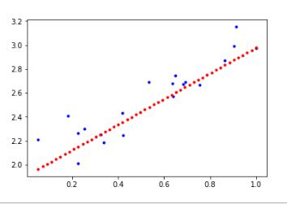
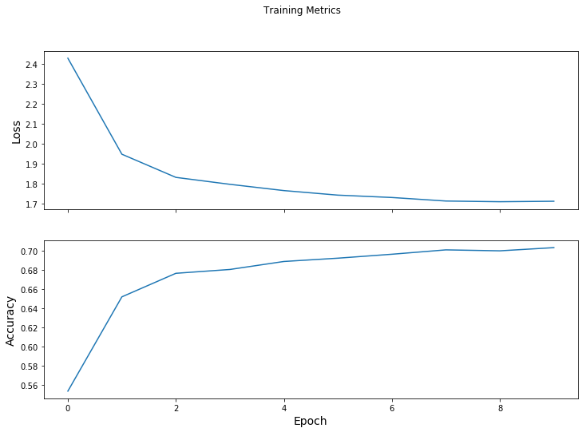

# Tensorflow Model Subclassing
- In this project i explored how to implement a subclass model, and subclass layer inheriting from `tensorflow.keras.models.Model` and `tensorflow.keras.layers.Layer`.
- You can get the code in [tensorflow_model_subclassing.ipynb](./tensorflow_model_subclassing.ipynb)

## Model Sublassing
- Created a simple model using model subclassing API
- Implemented custom layers by defining weights and bias, with matrix multiplication on call.

## Automatic Differentiation
- Implemented a simple linear regression layer to use the gradients for adjusting weights and bias.

## Custom Training Loops
- A simple training loop with outer loop over epochs and inner loop over batches.

# Setup
- Create virtual environment:  `python -m venv venv`
- Activate virtual environment: `call venv/Scripts/activate.bat` in cmd
- Install dependencies: `pip install -r requirements.txt`

# Libraries
- Tensorflow
- numpy
- matplotlib
- ipykernel

## Contact
 - LinkedIn: [Natan Asrat](https://linkedin.com/in/natan-asrat)
 - Gmail: nathanyilmaasrat@gmail.com
 - Telegram: [Natan Asrat](https://t.me/fail_your_way_to_success)
 - Youtube: [Natville](https://www.youtube.com/@natvilletutor)

